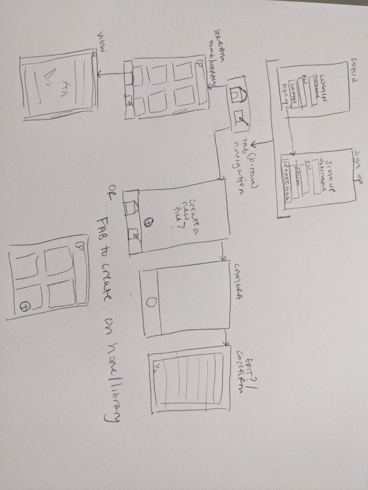
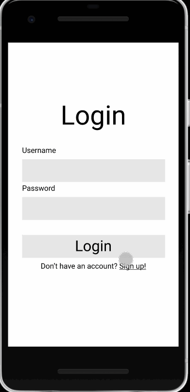

# DIGITAL PAPER??

## Table of Contents
1. [Overview](#Overview)
1. [Product Spec](#Product-Spec)
1. [Wireframes](#Wireframes)
2. [Schema](#Schema)

## Overview
### Description
Allows people to scan their handwritten documents with their phone cameras and convert them into easily searchable PDFs. The uploaded documents can then be annotated and organized with a table of contents.

### App Evaluation
- **Category:** Productivity
- **Mobile:** Mobile devices are convenient and allow for easy scanning of documents with the camera. 
- **Story:** Creates a convenient resource of handwritten documents, such as notes for a student. Allows students who prefer handwritten notes to more easily sift through a large amount of unorganized and unsearchable documents.
- **Market:** Any student or individual that handwrites often could utilize this app.
- **Habit:** Students are likely to use this each day, after the end of each notetaking session. Students would also use this app to study and annotate their uploaded notes.
- **Scope:** V1 would only scan documents using the camera and convert them into searchable documents. V2 would include a tagging system to organize documents. V3 would incorporate annotative features like a highlighter, setting breakpoints and/or a pen tool. V4 would let the user calibrate their handwriting to gain a more accurate scan for future scans.

## Product Spec

### 1. User Stories (Required and Optional)

**Required Must-have Stories**

* User can create a new account
* User can login
* User can scan a handwritten document
* User can view a library of previously scanned documents
* User can view an individual previously scanned document

**Optional Nice-to-have Stories**

* User can tag documents
* User can search for documents using their tags and names
* User can annotate documents with a highlighter
* User can set up breakpoints (table of contents) within a document
* User can calibrate their handwriting to obtain more accurate scans
* User can edit scanned documents to check for errors

### 2. Screen Archetypes

* Login Screen
   * User can login
* Register Screen
   * User can create a new account
* Stream
    * User can view a library of previously scanned documents
* Creation - Scan
    * User can scan a handwritten document
* View
    * User can view an individual previously scanned document

### 3. Navigation

**Tab Navigation** (Tab to Screen)

* Scan a Document
* Document Library

**Flow Navigation** (Screen to Screen)

* Login Screen
   * Create
* Register Screen
   * Create
* Stream
    * View
* Creation - Scan
    * Back to start of creation screens
    * Will need multiple screens to represent creation process to scan 
* View
    * back to Stream

## Wireframes
[Add picture of your hand sketched wireframes in this section]


### [BONUS] Digital Wireframes & Mockups


### [BONUS] Interactive Prototype



## Schema 
[This section will be completed in Unit 9]
### Models
Model: User
Property | Type | Description 
--- | --- | --- 
objectId | String | unique id for the user (default field)
--- | --- | --- 
createdAt | DateTime | date when account is created (default field)
--- | --- | --- 
updatedAt | DateTime | date when account is last updated (default field)
--- | --- | --- 
name | String | user's name 
--- | --- | --- 
password | String | user's password (to do this correctly it would be hashed but for simplicity sake) 
--- | --- | --- 
email | String | user's email they registered this account with 
--- | --- | --- 
profileImage | File | user's profile image (not necessary)
--- | --- | --- 
documents | Array | array of documents parse objects
--- | --- | --- 

Model: Document
Property | Type | Description
--- | --- | --- 
objectId | String | unique id for the document (default field)
--- | --- | --- 
createdAt | DateTime | date when document is created (default value)
--- | --- | --- 
updatedAt | DateTime | date when document is last updated (default value)
--- | --- | --- 
document | File | original file
--- | --- | --- 
convertedDoc | File | originally handwritten converted to a scannable pdf document 
### Networking
- [Add list of network requests by screen ]

* Stream
    * (Read/GET) Query all documents where user is author
    * ```
      let query = PFQuery(className:"User
      query.whereKey("author", equalTo: currentUser)
      query.order(byDescending: "createdAt")
      query.findObjectsInBackground { (users: [PFObject]?, error: Error?) in
         if let error = error { 
            print(error.localizedDescription)
         } else if let user = user {
            print("Successfully retrieved \(user).")
        // TODO: Do something with user...
         }
      }
      ```
    * (Delete) Delete existing document
* Creation - Scan
    * (Create/POST) Create a new document
* View
    * (Read/GET) specific document from objectId in array in User
    * ```
      let query = PFQuery(className:"Document")
      query.whereKey("author", equalTo: currentUser)
      query.order(byDescending: "createdAt")
      query.findObjectsInBackground { (documents: [PFObject]?, error: Error?) in
         if let error = error { 
            print(error.localizedDescription)
         } else if let document = document {
            print("Successfully retrieved \(document).")
        // TODO: Do something with document...
         }
      }
      ```

- [Create basic snippets for each Parse network request]
- [OPTIONAL: List endpoints if using existing API such as Yelp]
